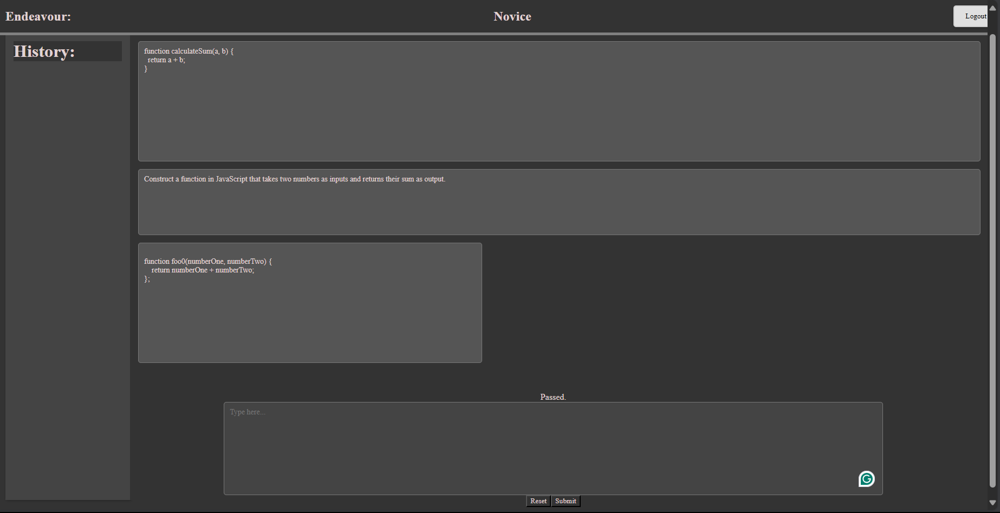

# CodeInsight

## The Main README.md

> It is important to note that this project is still underway. As such there are some functionalities that remain unimplemented or not fine-tuned. Please visit the "Issues" section for more information. If one should attempt to run the application anyhow, then using the Console to view in realtime the workings would be most instrumental in understanding the process(es).

> For a behind-the-scenes look at the project’s development process, see "DEV-NOTES.md"

---

> Note: In the context of this application, unless explicitly indicated otherwise, the type `number` refers to integers.

At its core, **CodeInsight** is a code comprehension application designed for first-year university students with little or no prior programming experience.

- Users are presented with a code snippet and asked to explain, in plain English, what the code does.
- Based on their explanation, new code is generated and run against pre-written test cases for the original snippet to measure functional equivalence.
- Feedback is provided both through the generated explanation from Ollama and an indication of whether tests passed or failed.

---

This application uses the **React** framework with the **Node.js** runtime, alongside **Ollama**.

- **Front end:** The student interacts through a visual React-based interface to submit code analyses.
- **Back end:** A locally running Ollama instance handles the code generation and analysis.
- **Dockerization:** Both front and back ends are containerized with Docker and interact in real time as the application runs.

**Note:** For the minimally viable product there needs to be only one user, and user persistence has not been implemented.

**Note:** This may be treated as a way to keep track of progress. After a MVP has been realized, this README.md will be relegated to progress tracking and a new README.md will be constructed that will adequately capture the functionality of the MVP, and thereafter if there is time, the finalized version of the project.

---

Highly desired (additional and yet **unimplemented**) functionality:

- A trivial login page (which may or may not enhance the application from an SPA).
- Data Persistence using JSONServer, for data persistence.
- Add the ability to access different codesnippets.
- Add functionality to the "History" Panel.
- Add the ability to see which tests passed and failed.

---

## Instructions for Docker Compose.

**VERY IMPORTANT:** Depending on your IDE configuration, the `entrypoint.sh` script may automatically adopt `CRLF` line endings. This is very troublesome: the script _must_ be in `LF` for composition to properly execute. I do take precautions with .gitignore, however.

Ensure you are in the root directory i.e. where the Docker and docker-compose.yml files reside.

The file that I use for this is called docker-compose.yml .

All that needs to be done is that you input into the terminal `docker-compose up --build` and all should be copacetic (for first time running). Please reference a Note below for additional options. You will find your docker image "installed," inside docker desktop, or it should be, at the very least visible to you inside the Docker extension for VS Code. The containers should be spun up, and you should be able to use the application.

> Note: Intend to remove: issue with sync fixed (at least without docker). Only need to optimize Ollama (make sure it still works).

> Note (For Docker Clarity if uninitiated):

- **Fast restart without rebuilding** If you already have spun the containers once using `docker-compose up --build` and haven't made changes to configurations (haven't changed Dockerfile or configuration (scripts, environment variables et cetera.)) use `docker-compose up`: it saves time as node dependencies and ollama are not redownloaded (the existing images are used). The containers are resumed or rebuilt (from cached images).
- **Reset with fresh containers** If you want to reset the containers each time (don't save state, such as logs (apart from explicitly persistent data)) use `docker-compose down`. In this manner the containers would be deleted BUT you can use `docker-compose up` for a fast build up as dependencies and ollama aren't reinstalled.`docker-compose down && docker-compose up`. This removes the containers but keeps your images, so the rebuild is still fast and doesn’t reinstall Node dependencies or redownload Ollama.
- **Pause and resume the same containers** If you simply stop the stack with `Ctrl+C`, the containers remain on your system in a stopped state. Running `docker-compose up` again will resume them with their state intact (including logs or any changes made inside the container).

---

# Tests

## React

- React Components; ensure coherence of state, via console logs, and visual inspection, and state integrity.

## Ollama

- Ensure all requests are handled properly; code parsed correctly.

- ollama container build.

- docker ctrl+c / terminating (stopping) the docker containers.
  ✔ Container project-groups-22-lab-d-app-1 Stopped 5.2s
  ✔ Container ollama Stopped 11.6s
  The above would ensure that the containers were stopped correctly.

## License

This project is licensed under the [Creative Commons Attribution-NonCommercial 4.0 International (CC BY-NC 4.0)](https://creativecommons.org/licenses/by-nc/4.0/).  
You may share and adapt this work non-commercially, as long as you provide appropriate credit.

## Final Note for Transparency

This was initially a project for a course. After the course ended, I lost access to the repository and only recently have recovered it. It is my endeavour to expand on and refine the initial MVP.
